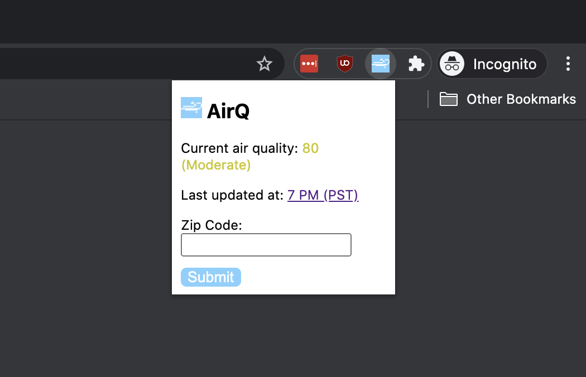

# AirQ

AirQ is a Chrome extension that pulls data from [AirNow's](https://www.airnow.gov/) API. 

Users can search for air quality based on zip code. 

Due to the API, only US zip codes can used. 

## Installation

1. Download the code as a ZIP folder
2. Unzip the folder
3. Open `popup.js` and replace `API_KEY` with your unique API key from AirNow's API
4. Go to settings on Google Chrome
5. Click on `Extensions`
6. Enable `Developer mode`
7. Click on `Load unpacked`
8. Search for the unzipped folder, select the folder, and click the `select` button